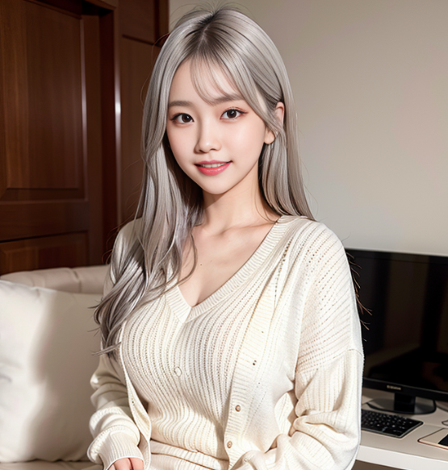

# Text-To-Image AI Girl Generator using Stable Diffusion

# README is WIP. making a yt video rn

## Text-To-Image of photo-realistic AI girl

Well, here we are. Using AI to generate photo-realistic asian girls. I'm using this to create a new 

These are actually rising in popularity, on twitter and other apps.

## Example 

See below to how to generate this same image.

## How to Start UI

Open stable_diffusion_1_5_webui_STABLE.ipynb in Google Collab. 
Connect to a runtime
Click Runtime -> Run All
At the end of "Run UI" step, there will be 

Running on public URL: https://30f119ff-c7c6-4a87.gradio.live

Click on the generated link to open the UI:

Then, follow these steps to 

## Disclaimer

Please understand that is all not real. Please do not sexualize people in general and understand the dangers of AI.
